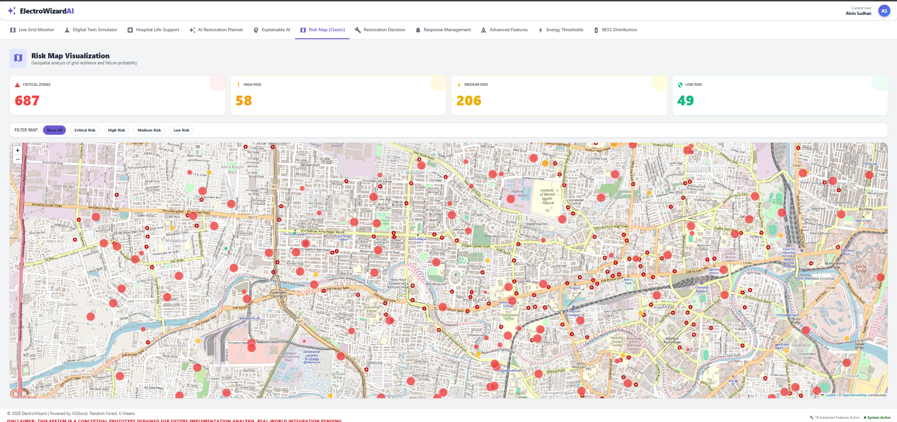
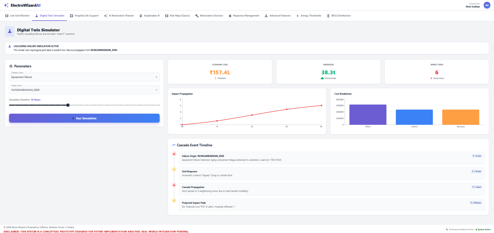
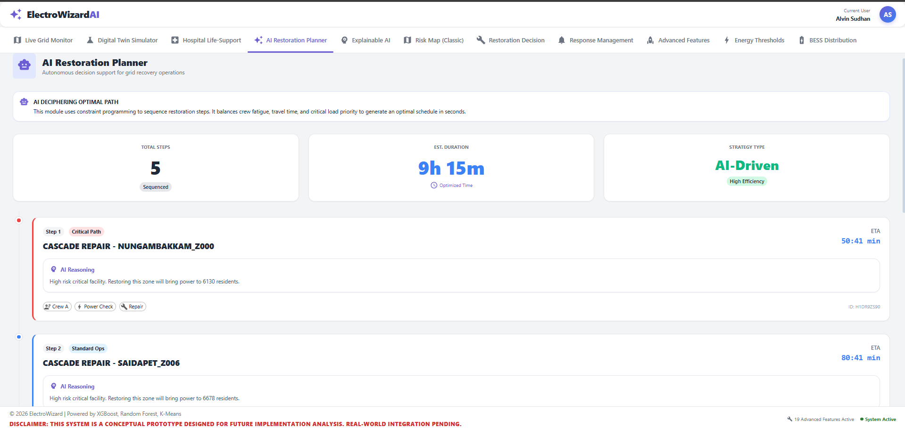
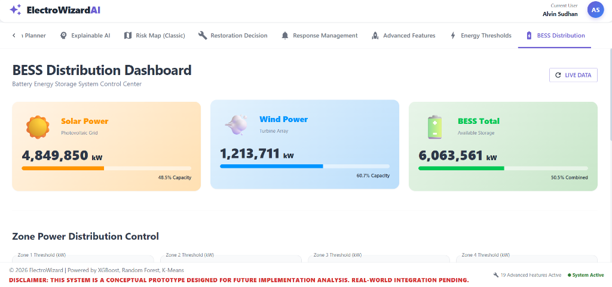

# ⚡ ElectroWizard AI - Digital Twin for Smart Grid Resilience

> **Winner/Project for [Hackathon Name]**  
> *AI-Driven Power Outage Prediction & Automated Restoration System*


*(Upload your dashboard screenshot here)*

## 📖 Overview
ElectroWizard is a **Digital Twin** solution designed to revolutionize urban power grid management. It uses **Machine Learning (XGBoost, Random Forest)** to predict outage impacts and an **Agentic AI** to autonomously coordinate restoration crews during disasters.

Unlike traditional static dashboards, ElectroWizard acts as a **Live Operating System**, capable of simulating cascading failures, managing hospital life-support systems in real-time, and optimizing repair schedules.

---

## 🚀 Key Features

### 🧠 **1. AI-Powered Prediction**
-   **Impact Forecasting:** Uses **XGBoost** to predict the economic and social impact of an outage (0-100 score).
-   **Risk Classification:** Uses **Random Forest** to classify zones as **Critical**, **High**, **Medium**, or **Low** risk.
-   **Explainable AI:** Tells you *why* a zone is critical using Decision Trees (e.g., "Critical because 2 Hospitals + Rain").

### 🌐 **2. Digital Twin Simulator**
-   **What-If Scenarios:** Simulate **Weather Events**, **Overloads**, or **Equipment Failures**.
-   **Dynamic Ripple Effect:** Watch how a failure in one zone cascades to neighbors based on load and distance.
-   **Real-Time Physics:** Simulation varies based on the specific "Outage Cause" selected.

### 🏥 **3. Hospital Life-Support Monitor**
-   **Real-Time Crisis:** Watch backup battery timers count down ($MM:SS$) in real-time.
-   **Visual Urgency:** Indicators pulse red when backup drops below 5 minutes.
-   **Auto-Triage:** Automatically escalates power restoration to hospitals with active ICUs.

### 🔧 **4. AI Restoration Planner**
-   **Autonomous Scheduling:** Generates optimal repair paths for crews.
-   **Live ETA:** Repair timelines count down in sync with the simulation.
-   **Resource Optimization:** Efficiently allocates crews, mobile generators, and spare parts.

---

## 🛠️ Technology Stack

| Component | Tech | Usage |
| :--- | :--- | :--- |
| **Frontend** | **React.js** | Interactive Dashboard, Material UI, Recharts |
| **Backend** | **Python (FastAPI)** | REST API, Simulation Logic, ML Inference |
| **ML Core** | **Scikit-Learn, XGBoost** | Predictive Models (Regression & Classification) |
| **Data** | **Pandas / NumPy** | Synthetic Data Generation & Manipulation |
| **Maps** | **Leaflet / React-Leaflet** | Geospatial Risk Visualization |

---

## ⚙️ Installation & Setup Guide

Follow these steps to run the project locally.

### 1️⃣ Prerequisites
-   **Node.js** (v14 or higher)
-   **Python** (v3.8 or higher)

### 2️⃣ Backend Setup (The Brain)
Open a terminal in the root directory:

```bash
# 1. Navigate to root
cd newveroxa

# 2. Create a virtual environment (Optional but Recommended)
python -m venv venv
# Windows:
.\venv\Scripts\activate
# Mac/Linux:
source venv/bin/activate

# 3. Install Python Dependencies
pip install -r backend/requirements.txt

# 4. Generate the AI Dataset (Important: Runs the simulation math)
python backend/dataset_generator.py

# 5. Train the AI Models
python backend/ml_models.py

# 6. Start the Server
python backend/main.py
```
> The Backend will start at: `http://localhost:8000`

### 3️⃣ Frontend Setup (The Visuals)
Open a **new** terminal window:

```bash
# 1. Navigate to frontend folder
cd frontend

# 2. Install Dependencies
npm install

# 3. Start the React App
npm start
```
> The Dashboard will open at: `http://localhost:3000`

---

## 📂 Project Structure

```
newveroxa/
├── backend/
│   ├── main.py                 # API Server Endpoints
│   ├── ml_models.py            # Phase 1: AI Model Training
│   ├── dataset_generator.py    # Generates realistic synthetic data
│   ├── restoration_priority.py # Phase 2: Crew Scheduling Logic
│   └── explainable_ai.py       # Phase 3: XAI Logic
├── frontend/
│   ├── src/
│   │   ├── components/         # React Components (RiskMap, Chatbot, etc.)
│   │   └── App.js              # Main Navigation
├── assets/                     # Demo Images / PPTs (Create this folder)
└── README.md                   # This file
```

---

## 📸 Demo Gallery

### 1. Risk Map (Big Visual)


### 2. Digital Twin Simulation


### 3. AI Restoration Plan


### 4. BESS Distribution Dashboard


---

## 📄 License
This project is licensed under the MIT License - see the LICENSE file for details.

---

> **Note for Judges:** This system uses a local generative logic for the simulation data to ensure consistent, reproducible demo scenarios without needing a live grid connection.
